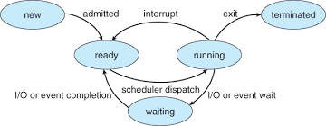
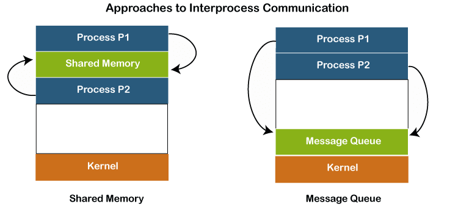

# Khái niệm quy trình (process)
Quy trình là một chương trình đang được thực thi.
Một quy trình bao gồm:
- Bộ đếm chương trình (program counter)
- Ngăn xếp (stack)
- Phần dữ liệu (data section)

# Process State
Khi một quy trình được thực thi, nó thay đổi trạng thái (state):
- Mới (new): quá trình đang được tạo
- Đang chạy (running): Các lệnh đang được thực thi.
- Đang chờ (waiting): Quy trình đang chờ một sự kiện nào đó xảy ra.
- Sẵn sàng (ready): Quy trình đang chờ được gán cho một bộ xử lý.
- Kết thúc (terminated): Quy trình đã hoàn thành việc thực thi.

# Process in Memory
Bộ nhớ của một tiến trình (process) trong hệ điều hành.
- **Text Segment (text):** Chứa mã lệnh (code) của chương trình, là vùng chỉ đọc và có thể chia sẻ giữa các tiến trình cùng mã.
- **Data Segment (data):** Chứa các biến đã khởi tạo và dữ liệu tĩnh, gồm các biến toàn cục và biến có bộ nhớ cố định trong suốt quá trình chạy.
- **Heap Segment (heap):** Dùng cho các biến cấp phát động với kích thước hoặc thời gian sống không xác định. Heap phát triển từ vùng data hướng lên, yêu cầu lập trình viên giải phóng thủ công để tránh rò rỉ bộ nhớ.
- **Stack Segment (stack):** Lưu trữ ngăn xếp hàm, các biến cục bộ và địa chỉ trả về khi hàm kết thúc. Stack phát triển từ trên xuống và tự động thu hẹp khi hàm kết thúc.
Ví dụ:
```cpp
#include <iostream>
#include <cstdlib>

// Biến toàn cục, thuộc vùng Data Segment
int globalVar = 42;

// Hàm thuộc vùng Text Segment
void printMessage() {
    std::cout << "Hello from the function!" << std::endl;
}

int main() {
    // Biến cục bộ, thuộc vùng Stack Segment
    int localVar = 10;

    // Cấp phát động biến trên Heap Segment
    int* dynamicVar = (int*)malloc(sizeof(int));
    *dynamicVar = 20;

    // In giá trị của các biến
    std::cout << "Global Variable: " << globalVar << std::endl;   // Biến toàn cục
    std::cout << "Local Variable: " << localVar << std::endl;     // Biến cục bộ
    std::cout << "Dynamic Variable: " << *dynamicVar << std::endl;// Biến trên heap

    // Gọi hàm (hàm thuộc Text Segment)
    printMessage();

    // Giải phóng bộ nhớ trên heap
    free(dynamicVar);

    return 0;
}
```

# Diagram of process state

- **New**:
    - Tiến trình vừa được tạo, nhưng chưa được đưa vào hàng đợi sẵn sàng (ready queue). Trong giai đoạn này, hệ thống sẽ cấp phát tài nguyên cần thiết cho tiến trình.
- **Ready**:
    - Tiến trình đã sẵn sàng chạy nhưng đang chờ được cấp phát CPU.
- **Running**:
    - Tiến trình đang thực sự được CPU thực hiện.
- **Waiting**:
    - Tiến trình đang chờ một sự kiện bên ngoài, chẳng hạn như hoàn tất I/O hoặc tín hiệu từ một tiến trình khác.
- **Terminated**:
    - Tiến trình đã hoàn thành công việc và được kết thúc hoặc bị hệ điều hành chấm dứt. Bộ nhớ và tài nguyên của nó sẽ được giải phóng.

**Các chuyển đổi trạng thái chính:**
- **New -> Ready**: Tiến trình được hệ điều hành chấp nhận và đưa vào hàng đợi sẵn sàng.
- **Ready -> Running**: Bộ lập lịch (scheduler) chọn tiến trình từ hàng đợi sẵn sàng và cấp CPU cho nó.
- **Running -> Waiting**: Tiến trình đang chạy yêu cầu chờ I/O hoặc một sự kiện, chuyển sang trạng thái chờ.
- **Waiting -> Ready**: Sự kiện hoặc I/O hoàn tất, tiến trình quay lại hàng đợi sẵn sàng.
- **Running -> Terminated**: Tiến trình hoàn thành hoặc thoát.
- **Running -> Ready**: Tiến trình bị gián đoạn (interrupt) và đưa về hàng đợi sẵn sàng chờ CPU.

# Process Control Block (PCB)
Process Control Block (PCB) là một cấu trúc dữ liệu quan trọng trong hệ điều hành, được sử dụng để lưu trữ thông tin về một tiến trình cụ thể. PCB giúp hệ điều hành quản lý và theo dõi các tiến trình trong hệ thống. Dưới đây là các thành phần chính của PCB:
1. **Process State (Trạng thái tiến trình)**:
    - Thông tin về trạng thái hiện tại của tiến trình (ví dụ: mới, sẵn sàng, đang chạy, đang chờ, hoặc đã kết thúc).
2. **Program Counter (Bộ đếm chương trình)**:
    - Địa chỉ của lệnh tiếp theo mà tiến trình sẽ thực thi. Điều này cho phép hệ điều hành biết được tiến trình đang ở đâu trong mã lệnh của nó.
3. **CPU Registers (Thanh ghi CPU)**:
    - Giá trị của các thanh ghi CPU mà tiến trình đang sử dụng. Khi một tiến trình bị tạm dừng, giá trị của các thanh ghi này (bao gồm bộ tích lũy, con trỏ cơ sở, con trỏ ngăn xếp, v.v..) sẽ được lưu trữ trong PCB để có thể phục hồi khi tiến trình được tiếp tục.
4. **CPU Scheduling Information (Thông tin lập lịch CPU)**:
    - Thông tin liên quan đến việc lập lịch cho tiến trình, chẳng hạn như độ ưu tiên của tiến trình, thời gian CPU đã sử dụng, và các thông tin khác cần thiết cho việc quản lý tiến trình.
5. **Memory-management Information (Thông tin quản lý bộ nhớ)**:
    - Thông tin về bộ nhớ mà tiến trình đang sử dụng, bao gồm địa chỉ bắt đầu và kích thước của không gian bộ nhớ mà tiến trình đã được cấp phát.
6. **Accounting Information (Thông tin kế toán)**:
    - Thông tin liên quan đến việc theo dõi tài nguyên mà tiến trình đã sử dụng, chẳng hạn như thời gian CPU, thời gian thực hiện, và các tài nguyên khác.
7. **I/O Status Information (Thông tin trạng thái I/O)**:
    - Thông tin về các thiết bị I/O mà tiến trình đang sử dụng hoặc đang chờ, giúp hệ điều hành quản lý các yêu cầu I/O của tiến trình.

## Vai trò
- Quản lý trạng thái process: PCB cho phép hệ điều hành biết trạng thái hiện tại của mỗi process, từ đó đưa ra quyết định lập lịch và phân bổ tài nguyên hiệu quả.
- Chuyển đổi ngữ cảnh: Khi chuyển đổi giữa các process, hệ điều hành sử dụng PCB để lưu và khôi phục bối cảnh của process, đảm bảo process có thể tiếp tục thực thi từ điểm bị ngắt.
- Phân bổ và giải phóng tài nguyên: PCB chứa thông tin về tài nguyên mà process đang sử dụng, giúp hệ điều hành phân bổ và giải phóng tài nguyên một cách hiệu quả.
- Bảo vệ và cách ly process: PCB giúp hệ điều hành cách ly các process với nhau, đảm bảo mỗi process chỉ truy cập được tài nguyên được phép.

## Lưu ý
- Mỗi process đều có một PCB riêng.
- PCB được lưu trữ trong vùng nhớ của hệ điều hành.
- PCB là một cấu trúc dữ liệu phức tạp, có thể thay đổi tùy theo hệ điều hành cụ thể.

# CPU Switch from process to process
Chuyển đổi CPU (CPU Switch) là quá trình hệ điều hành chuyển quyền điều khiển CPU từ một process đang chạy sang một process khác đang chờ trong hàng đợi sẵn sàng. Quá trình này là cốt lõi của đa nhiệm (multitasking), cho phép nhiều process chia sẻ CPU và tạo cảm giác như chúng đang chạy đồng thời.
## Các bước trong quá trình chuyển đổi CPU:

1. Lưu trạng thái của process hiện tại: Hệ điều hành lưu toàn bộ thông tin về trạng thái của process đang chạy vào Process Control Block (PCB) của nó. Thông tin này bao gồm:
	- Giá trị của bộ đếm chương trình (Program Counter)
	- Giá trị của các thanh ghi CPU
	- Thông tin về bộ nhớ và tài nguyên mà process đang sử dụng
2. Chọn process tiếp theo để chạy: Hệ điều hành sử dụng thuật toán lập lịch để chọn process tiếp theo trong hàng đợi sẵn sàng.
3. Nạp trạng thái của process mới: Hệ điều hành nạp thông tin từ PCB của process được chọn vào CPU, khôi phục trạng thái của process này.
4. Bắt đầu thực thi process mới: CPU bắt đầu thực thi các lệnh của process mới từ điểm đã lưu trong PCB.

## Thời gian chuyển đổi ngữ cảnh (Context Switch Time):
- Thời gian cần thiết để thực hiện việc chuyển đổi CPU từ process này sang process khác được gọi là thời gian chuyển đổi ngữ cảnh.
- Đây là thời gian overhead vì trong khoảng thời gian này, hệ thống không thực hiện bất kỳ công việc hữu ích nào.
- Thời gian chuyển đổi ngữ cảnh phụ thuộc vào phần cứng và hệ điều hành, thường dao động trong khoảng vài mili giây.

# Process Scheduling Queues
1. **Job Queue (Hàng đợi công việc)**: Chứa tất cả các tiến trình trong hệ thống, bao gồm cả những tiến trình đang chờ để được thực thi.
2. **Ready Queue (Hàng đợi sẵn sàng)**: Gồm các tiến trình đã được tải vào bộ nhớ và sẵn sàng để thực thi. Hệ điều hành sử dụng bộ lập lịch để chọn tiến trình tiếp theo từ hàng đợi này.
3. **Device Queues (Hàng đợi thiết bị)**: Chứa các tiến trình đang chờ sử dụng một thiết bị I/O cụ thể. Khi một tiến trình yêu cầu I/O, nó sẽ chuyển từ hàng đợi sẵn sàng sang hàng đợi thiết bị cho đến khi hoàn tất.
Các tiến trình có thể di chuyển giữa các hàng đợi tùy thuộc vào trạng thái và yêu cầu của chúng, giúp tối ưu hóa việc sử dụng CPU và tài nguyên hệ thống.

## Scheduler
1. **Long-term Scheduler (Bộ lập lịch dài hạn)**:
    - Còn gọi là job scheduler, quyết định tiến trình nào được đưa vào hàng đợi sẵn sàng từ hàng đợi công việc. Nó kiểm soát mức độ đa chương trình và hoạt động không thường xuyên (seconds, minutes). Bộ lập lịch dài hạn kiểm soát mức độ đa chương trình (degree of multiprogramming), tức là số lượng tiến trình có thể tồn tại trong bộ nhớ cùng một lúc.
2. **Short-term Scheduler (Bộ lập lịch ngắn hạn)**:
    - Còn gọi là CPU scheduler, quyết định tiến trình nào sẽ được thực thi tiếp theo trên CPU. Hoạt động thường xuyên (milliseconds) và cần phải nhanh chóng để tối ưu hóa hiệu suất hệ thống.
3. **Medium-term Scheduler (Bộ lập lịch trung hạn)**:
    - Tạm thời loại bỏ tiến trình khỏi bộ nhớ để giảm tải và có thể đưa chúng trở lại khi có đủ tài nguyên.
4. **Phân loại tiến trình**: Tiến trình có thể được phân loại thành:
    - **I/O-bound process**: Tiến trình này dành nhiều thời gian cho các hoạt động I/O hơn là tính toán, thường có nhiều chu kỳ CPU ngắn.
    - **CPU-bound process**: Tiến trình này dành nhiều thời gian cho tính toán hơn, thường có ít chu kỳ CPU nhưng dài.


# Process Creation
**Process Creation (Tạo tiến trình)** là quá trình mà một tiến trình cha (parent process) tạo ra các tiến trình con (child processes), hình thành một cấu trúc giống như cây:
1. **Quá trình tạo**:
    - Tiến trình cha có thể tạo ra nhiều tiến trình con, và các tiến trình con cũng có thể tạo ra tiến trình con của riêng chúng.
2. **Quản lý tiến trình**:
    - Mỗi tiến trình được xác định và quản lý thông qua một **process identifier (pid)**, giúp hệ thống theo dõi và quản lý các tiến trình.
3. **Chia sẻ tài nguyên**: Tiến trình cha và các tiến trình con có thể chia sẻ tài nguyên theo các cách khác nhau:
    - Tất cả tài nguyên được chia sẻ.
    - Chỉ một tập hợp con tài nguyên được chia sẻ.
    - Không chia sẻ tài nguyên nào.
4. **Thực thi**:
    - Tiến trình cha và các tiến trình con có thể thực thi đồng thời (concurrently), nhưng tiến trình cha có thể chờ cho đến khi các tiến trình con hoàn thành trước khi tiếp tục.
5. **Không gian địa chỉ**:
    - Tiến trình con là bản sao của tiến trình cha, nhưng có không gian địa chỉ riêng. Điều này có nghĩa là tiến trình con có thể hoạt động độc lập mà không ảnh hưởng đến tiến trình cha.
6. **Chương trình được tải**:
    - Sau khi tạo ra, tiến trình con có thể có một chương trình khác được tải vào không gian bộ nhớ của nó. Điều này cho phép tiến trình con thực hiện một tác vụ khác biệt so với tiến trình cha.
7. **Hệ thống UNIX**:
    - Trong hệ thống UNIX, quá trình tạo tiến trình thường sử dụng hai lệnh hệ thống:
        - **fork**: Tạo một tiến trình con mới bằng cách sao chép tiến trình cha.
        - **exec**: Được sử dụng sau lệnh fork để thay thế không gian bộ nhớ của tiến trình con bằng một chương trình mới.

# Process Termination
1. **Kết thúc tiến trình**:
    - Khi một tiến trình thực hiện xong các lệnh của nó, nó sẽ gọi hệ điều hành để yêu cầu xóa bỏ nó, thường thông qua lệnh **exit**.
2. **Truyền dữ liệu**:
    - Tiến trình con có thể truyền dữ liệu đầu ra về cho tiến trình cha thông qua lệnh **wait**, cho phép tiến trình cha nhận biết khi nào tiến trình con đã hoàn thành.
3. **Giải phóng tài nguyên**:
    - Sau khi tiến trình kết thúc, hệ điều hành sẽ giải phóng tất cả tài nguyên mà tiến trình đó đã sử dụng, như bộ nhớ và các tài nguyên khác.
4. **Kết thúc tiến trình con bởi tiến trình cha**:
    - Tiến trình cha có thể kết thúc các tiến trình con của nó (abort) trong một số trường hợp, chẳng hạn như khi tiến trình con vượt quá tài nguyên được cấp phát hoặc khi nhiệm vụ của tiến trình con không còn cần thiết.
5. **Kết thúc dây chuyền**
    - Một số hệ điều hành không cho phép tiến trình con tiếp tục hoạt động nếu tiến trình cha của nó kết thúc, dẫn đến hiện tượng **cascading termination**, nơi tất cả các tiến trình con cũng sẽ bị kết thúc.

# Interprocess Communication (IPC)
IPC cho phép các tiến trình độc lập hoặc hợp tác chia sẻ thông tin và dữ liệu, giúp chúng hoạt động hiệu quả hơn.
1. **Các mô hình IPC**:
    - **Chia sẻ bộ nhớ**: Các tiến trình có thể truy cập vào một vùng bộ nhớ chung để đọc và ghi dữ liệu. Điều này yêu cầu cơ chế đồng bộ hóa để tránh xung đột.
    - **Gửi và nhận tin nhắn**: Các tiến trình giao tiếp thông qua việc gửi và nhận tin nhắn. Điều này có thể được thực hiện qua các lệnh như `send(message)` và `receive(message)`.
2. **Lợi ích của IPC**:
    - **Chia sẻ thông tin**: Giúp các tiến trình chia sẻ dữ liệu mà không cần phải sao chép.
    - **Tăng tốc độ tính toán**: Các tiến trình có thể làm việc song song, giảm thời gian hoàn thành nhiệm vụ.
    - **Tính mô-đun**: Cho phép phát triển các ứng dụng phức tạp bằng cách chia nhỏ thành các tiến trình nhỏ hơn, dễ quản lý hơn.
3. **Các loại liên kết**:
    - **Liên kết trực tiếp**: Các tiến trình phải chỉ định nhau một cách rõ ràng để gửi và nhận tin nhắn. A muốn gửi một tin nhắn đến tiến trình B, nó sẽ sử dụng lệnh `send(B, message)`. Tiến trình B sẽ nhận tin nhắn bằng lệnh `receive(A, message)`.
    - **Liên kết gián tiếp**: Sử dụng hộp thư (mailbox) để gửi và nhận tin nhắn, cho phép nhiều tiến trình giao tiếp thông qua một điểm chung. A gửi một tin nhắn đến một hộp thư (mailbox) có ID là M. Lệnh gửi sẽ là `send(M, message)`. Tiến trình B có thể nhận tin nhắn từ hộp thư M bằng lệnh `receive(M, message)`.


# Synchronization
1. **Mục đích**:
    - Đảm bảo rằng các tiến trình không can thiệp lẫn nhau khi truy cập vào tài nguyên chung, như bộ nhớ, tệp tin, hoặc thiết bị.
2. **Các phương pháp đồng bộ hóa**:
    - **Khóa (Mutex)**: Một cơ chế cho phép chỉ một tiến trình hoặc luồng truy cập vào tài nguyên tại một thời điểm. Khi một tiến trình chiếm khóa, các tiến trình khác phải chờ cho đến khi khóa được giải phóng.
    - **Semaphore**: Một biến đếm cho phép quản lý số lượng tiến trình có thể truy cập vào tài nguyên. Semaphore có thể là nhị phân (chỉ có giá trị 0 hoặc 1) hoặc có giá trị lớn hơn, cho phép nhiều tiến trình truy cập đồng thời.
3. **Blocking vs. Non-blocking**:
    - **Blocking (Đồng bộ)**: Khi một tiến trình thực hiện một thao tác gửi hoặc nhận tin nhắn, nó sẽ bị chặn cho đến khi thao tác đó hoàn thành. Ví dụ, trong một lệnh gửi, tiến trình sẽ chờ cho đến khi tin nhắn được nhận.
    - **Non-blocking (Không đồng bộ - asynchronous)**: Tiến trình sẽ không bị chặn và có thể tiếp tục thực hiện các tác vụ khác ngay cả khi thao tác gửi hoặc nhận chưa hoàn thành. Ví dụ, trong một lệnh gửi không đồng bộ, tiến trình sẽ gửi tin nhắn và tiếp tục mà không cần chờ phản hồi.
4. **Tầm quan trọng**:
    - Đồng bộ hóa là cần thiết để tránh các vấn đề như deadlock (khóa chết), race condition (điều kiện đua), và đảm bảo tính nhất quán của dữ liệu trong các ứng dụng đa tiến trình.

# Buffering
- Buffering giúp điều hòa tốc độ giữa các tiến trình gửi và nhận, giảm thiểu thời gian chờ đợi và tăng hiệu suất giao tiếp.
- Buffering giúp cải thiện hiệu suất và độ tin cậy của giao tiếp giữa các tiến trình, đặc biệt trong các hệ thống có nhiều tiến trình hoạt động đồng thời.
- **Các loại buffering**:
    - **Zero capacity (Không có dung lượng)**: Hàng đợi không chứa tin nhắn nào. Trong trường hợp này, tiến trình gửi phải chờ cho đến khi tiến trình nhận sẵn sàng để nhận tin nhắn (rendezvous).
    - **Bounded capacity (Dung lượng giới hạn)**: Hàng đợi có dung lượng hữu hạn, cho phép lưu trữ một số lượng tin nhắn nhất định (n tin nhắn). Nếu hàng đợi đầy, tiến trình gửi sẽ phải chờ cho đến khi có chỗ trống.
    - **Unbounded capacity (Dung lượng không giới hạn)**: Hàng đợi có thể chứa một số lượng tin nhắn không giới hạn. Trong trường hợp này, tiến trình gửi không bao giờ phải chờ, vì luôn có chỗ để gửi tin nhắn.

# Remote Procedure Calls
- RPC cho phép các tiến trình giao tiếp qua mạng bằng cách gọi các thủ tục từ xa, giúp ẩn đi sự phức tạp của giao tiếp mạng. Cho phép một chương trình thực hiện một thủ tục (procedure) trên một máy tính khác như thể nó đang thực hiện thủ tục đó trên máy tính của chính nó.
- RPC giúp đơn giản hóa việc phát triển ứng dụng phân tán bằng cách cho phép lập trình viên tập trung vào logic của ứng dụng mà không cần lo lắng về chi tiết giao tiếp mạng.
- RPC có thể sử dụng nhiều giao thức khác nhau để truyền tải dữ liệu, tùy thuộc vào yêu cầu của ứng dụng.
- Tính trừu tượng: RPC ẩn đi các chi tiết phức tạp của giao tiếp mạng, giúp lập trình viên dễ dàng hơn trong việc phát triển ứng dụng phân tán.
- Tính linh hoạt: RPC có thể được sử dụng trong nhiều ngữ cảnh khác nhau, từ các ứng dụng web đến các dịch vụ microservices.
- **Cách hoạt động**:
    - Khi một client muốn gọi một thủ tục trên server, nó sẽ sử dụng một **stub** (proxy) ở phía client. Stub này sẽ thực hiện việc tìm kiếm server và chuẩn bị các tham số cần thiết để gửi.
    - Tham số được "marshalled" (đóng gói) và gửi qua mạng đến server.
    - Tại server, một stub khác sẽ nhận thông điệp, "unmarshal" (giải nén) các tham số và thực hiện thủ tục yêu cầu.
    - Kết quả của thủ tục sẽ được gửi trở lại client qua mạng.

# Remote Method Invocation
Là phiên bản mở rộng của RPC, được tối ưu hóa cho Java.
