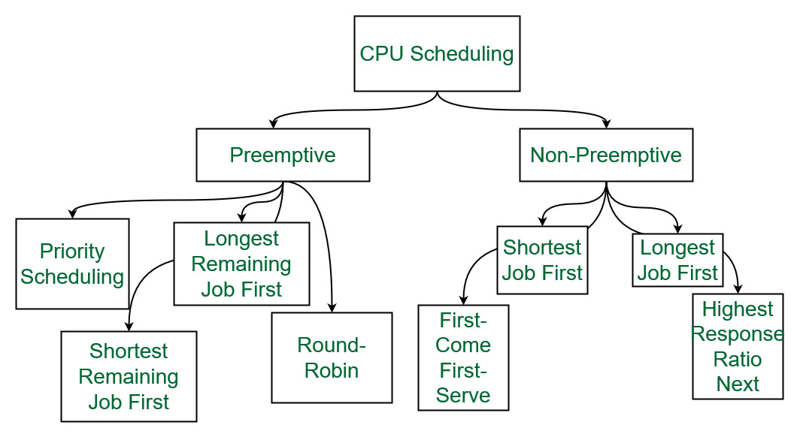

# CPU Scheduler
Bộ lịch biểu CPU là một phần quan trọng trong hệ điều hành, đảm nhiệm việc quyết định tiến trình nào sẽ được cấp phát CPU tại một thời điểm nhất định. Nói cách khác, bộ lịch biểu CPU đóng vai trò "người điều phối" cho CPU, giúp tối ưu hóa hiệu suất hệ thống bằng cách:
- Giữ CPU luôn bận rộn.
- Giảm thiểu thời gian chờ của các tiến trình.

Bộ lịch biểu CPU chọn tiến trình từ tập các tiến trình trong bộ nhớ đã sẵn sàng để thực thi, sau đó cấp phát CPU cho một trong số chúng.

## Các Quyết Định Lịch Biểu CPU:
Bộ lịch biểu CPU sẽ đưa ra quyết định lịch biểu khi một tiến trình:
- Chuyển từ trạng thái running sang waiting.
- Chuyển từ trạng thái running sang ready.
- Chuyển từ trạng thái waiting sang ready.
- Kết thúc (terminate).
## Phân loại Lịch Biểu:
- Non-preemptive (không chiếm quyền ưu tiên): Xảy ra khi tiến trình tự nguyện nhường CPU (chuyển sang waiting hoặc terminate).
- Preemptive (chiếm quyền ưu tiên): Xảy ra khi hệ điều hành cưỡng chế ngắt tiến trình đang chạy để chuyển CPU cho tiến trình khác.

# Dispatcher
Dispatcher là mô-đun chịu trách nhiệm chuyển quyền điều khiển CPU cho tiến trình được bộ lịch biểu CPU lựa chọn(short-term scheduler). 
Quá trình này bao gồm:
- Chuyển đổi ngữ cảnh (context switching): Lưu state hiện tại.
- Chuyển sang chế độ người dùng (user mode).
- Nhảy đến vị trí thích hợp trong chương trình người dùng để khởi động lại chương trình.

## Dispatcher Latency
Độ trễ phân phối là thời gian mà Dispatcher cần để dừng một tiến trình và bắt đầu chạy một tiến trình khác. Độ trễ này càng ngắn, hiệu suất hệ thống càng cao.

# Scheduling Criteria
Để đánh giá hiệu quả của thuật toán lịch biểu CPU, ta dựa trên các tiêu chí sau:
- CPU utilization (Mức độ Sử dụng CPU): Tỷ lệ phần trăm thời gian mà CPU được sử dụng. Cần tối đa hóa tiêu chí này.
- Throughput (Lưu lượng): Số lượng tiến trình hoàn thành trong một đơn vị thời gian. Cần tối đa hóa tiêu chí này.
- Turnaround time (Thời gian Chuyển Biến): Thời gian cần thiết để một tiến trình hoàn thành. Cần giảm thiểu tiêu chí này.
- Waiting time (Thời gian Chờ): Thời gian mà một tiến trình chờ trong hàng đợi ready. Cần giảm thiểu tiêu chí này.
- Response time (Thời gian Phản Hồi): Thời gian từ khi yêu cầu được gửi đến khi phản hồi đầu tiên được tạo ra (trong môi trường time-sharing). Cần giảm thiểu tiêu chí này.

# Scheduling Algorithm
Một số thuật ngữ:
- **Arrival Time** (Thời Gian Đến): Thời điểm mà một tiến trình đến hàng đợi ready, sẵn sàng để được CPU xử lý.
- **Completion Time** (Thời Gian Hoàn Thành): Thời điểm mà một tiến trình kết thúc việc thực thi.
- **Burst Time** (Thời Gian Xử Lý): Khoảng thời gian mà một tiến trình cần để CPU thực thi.
- Turn Around Time (Thời Gian Chuyển Biến): Khoảng thời gian chênh lệch giữa thời gian hoàn thành và thời gian đến của một tiến trình. Nói cách khác, Turn Around Time là tổng thời gian mà một tiến trình trải qua trong hệ thống, từ lúc đến cho đến khi kết thúc.
	- Công thức tính: Turn Around Time = Completion Time - Arrival Time
- Waiting Time (Thời Gian Chờ): Khoảng thời gian mà một tiến trình chờ trong hàng đợi ready trước khi được CPU xử lý.
	- Công thức tính: Waiting Time = Turn Around Time - Burst Time


## First-Come, First-Served (FCFS)
Là thuật toán lập lịch CPU đơn giản nhất.
### Cơ chế hoạt động:
- Tiến trình nào đến trước sẽ được cấp phát CPU trước.
- Tiến trình được cấp phát CPU sẽ chạy cho đến khi kết thúc hoặc tự nguyện nhường CPU (chuyển sang trạng thái waiting).
### Ưu điểm:
- Dễ dàng cài đặt.
- Công bằng cho các tiến trình, vì tiến trình nào đến trước sẽ được phục vụ trước.
### Nhược điểm:
- Thời gian chờ trung bình (average waiting time) có thể cao, đặc biệt khi có sự chênh lệch lớn về thời gian chạy của các tiến trình.
- Hiệu ứng đoàn xe (convoy effect): Các tiến trình ngắn phải chờ đợi phía sau các tiến trình dài, dẫn đến lãng phí tài nguyên CPU.

## Shortest-Job-First (SJF)
Shortest Job First (SJF), hay còn gọi là Shortest Job Next (SJN), là một thuật toán lập lịch CPU chiếm quyền ưu tiên (preemptive) hoặc không chiếm quyền ưu tiên (non-preemptive). SJF ưu tiên cho các tiến trình có thời gian xử lý (burst time) ngắn nhất. Mục tiêu của SJF là giảm thiểu thời gian chờ trung bình (average waiting time) cho tất cả các tiến trình.
### Cơ chế hoạt động:
- SJF hoạt động dựa trên nguyên tắc luôn chọn tiến trình có thời gian xử lý ngắn nhất trong hàng đợi ready để cấp phát CPU.
- SJF Non-Preemptive: Khi một tiến trình được cấp phát CPU, nó sẽ chạy cho đến khi kết thúc.
- SJF Preemptive: Nếu một tiến trình mới đến hàng đợi ready có ***thời gian xử lý ngắn hơn*** tiến trình đang chạy, hệ điều hành sẽ ngắt tiến trình đang chạy và cấp phát CPU cho tiến trình mới. Thời gian xử lý ở đây là thời gian xử lý còn lại.
### Ưu điểm:
- Tối ưu về thời gian chờ trung bình: SJF đảm bảo thời gian chờ trung bình thấp nhất so với các thuật toán lập lịch khác cho một tập hợp tiến trình nhất định. Điều này giúp tăng hiệu suất tổng thể của hệ thống.
- Giảm thiểu hiệu ứng đoàn xe: Bằng cách ưu tiên cho các tiến trình ngắn, SJF giảm thiểu khả năng các tiến trình ngắn bị kẹt sau các tiến trình dài.
### Nhược điểm:
- Khó khăn trong việc dự đoán thời gian xử lý: Trong thực tế, ta không thể biết chính xác thời gian xử lý của một tiến trình trước khi nó kết thúc.
- Khả năng bỏ đói các tiến trình dài: Nếu các tiến trình ngắn liên tục đến hàng đợi ready, các tiến trình dài có thể bị bỏ đói (starvation) và không bao giờ được cấp phát CPU.
### Phương pháp dự đoán thời gian xử lý:
Để khắc phục nhược điểm về việc dự đoán thời gian xử lý, ta có thể sử dụng các phương pháp ước lượng dựa trên lịch sử thực thi của tiến trình, chẳng hạn như sử dụng kỹ thuật trung bình mũ (exponential averaging).
- Công thức trung bình mũ: τ<sub>n+1</sub> = αt<sub>n</sub> + (1 - α)τ<sub>n</sub>
	- τ<sub>n+1</sub>: Thời gian xử lý dự đoán cho lần chạy tiếp theo.
	- t<sub>n</sub>: Thời gian xử lý thực tế của lần chạy thứ n.
	- τ<sub>n</sub>: Thời gian xử lý dự đoán cho lần chạy thứ n.
	- α: Tham số điều chỉnh (0 ≤ α ≤ 1), quyết định mức độ ảnh hưởng của lịch sử thực thi.
		- α = 0: Lịch sử thực thi không được tính đến.
		- α = 1: Chỉ thời gian xử lý của lần chạy cuối cùng được tính đến.
### Giải pháp cho vấn đề bỏ đói:
Để giải quyết vấn đề bỏ đói, ta có thể sử dụng kỹ thuật lão hóa (aging). Kỹ thuật này tăng dần mức độ ưu tiên của các tiến trình chờ đợi lâu trong hàng đợi, đảm bảo chúng cuối cùng cũng được cấp phát CPU.
### Ví dụ
SJF preemptive (shortest remaining job first)
Tiến trình A: đến lúc 0s, burst time 4s.
Tiến trình B: đến lúc 3s, burst time 2s.

| Thời gian | Tiến trình đang chạy | Hàng đợi ready | Ghi chú                                                        |
| --------- | -------------------- | -------------- | -------------------------------------------------------------- |
| 0s        | A                    |                | A bắt đầu chạy                                                 |
| 1s        | A                    |                |                                                                |
| 2s        | A                    |                |                                                                |
| 3s        | A                    | B              | B đến, nhưng A vẫn chạy vì có thời gian xử lý còn lại ngắn hơn |
| 4s        | B                    |                | A kết thúc, B được cấp CPU                                     |
| 6s        |                      |                | B kết thúc                                                     |
## Priority Scheduling
Mỗi tiến trình được gán một mức độ ưu tiên cụ thể. CPU được cấp phát cho tiến trình có mức ưu tiên cao nhất. Mức ưu tiên thường được biểu thị bằng một số nguyên, số nguyên nhỏ hơn biểu thị mức ưu tiên cao hơn.
### Phân loại:
- Chiếm quyền ưu tiên (Preemptive): Nếu một tiến trình mới có mức ưu tiên cao hơn tiến trình đang chạy, hệ điều hành sẽ ngắt tiến trình đang chạy và cấp phát CPU cho tiến trình mới đến.
- Không chiếm quyền ưu tiên (Non-preemptive): Tiến trình đang chạy sẽ được phép hoàn thành, ngay cả khi có tiến trình mới đến có mức ưu tiên cao hơn.
### Đặc điểm:
- Linh hoạt: Cho phép người dùng hoặc hệ thống tùy chỉnh mức độ quan trọng của các tiến trình bằng cách gán mức ưu tiên khác nhau.
- SJF là một dạng đặc biệt của Priority Scheduling: Trong SJF, mức ưu tiên được xác định bởi thời gian xử lý dự kiến của mỗi tiến trình. Tiến trình có thời gian xử lý dự kiến ngắn hơn sẽ có mức ưu tiên cao hơn.
### Vấn đề:
- Bỏ đói (Starvation): Các tiến trình có mức ưu tiên thấp có thể không bao giờ được cấp phát CPU nếu liên tục có các tiến trình mới đến có mức ưu tiên cao hơn.
### Giải pháp:
- Lão hóa (Aging): Kỹ thuật này tăng dần mức ưu tiên của các tiến trình chờ đợi lâu trong hàng đợi, đảm bảo chúng cuối cùng cũng được cấp phát CPU.
### Ví dụ
| Tiến trình | Mức ưu tiên | Thời gian xử lý |
| ---------- | ----------- | --------------- |
| A          | 2           | 5               |
| B          | 1           | 3               |
| C          | 3           | 2               |
- Trường hợp 1: Priority Scheduling không chiếm quyền ưu tiên
	Giả sử các tiến trình đến theo thứ tự A, B, C. Vì A đến trước, nó sẽ được cấp CPU và chạy trong 5 đơn vị thời gian. Sau đó, B được chạy trong 3 đơn vị thời gian, và cuối cùng C được chạy trong 2 đơn vị thời gian.

- Trường hợp 2: Priority Scheduling chiếm quyền ưu tiên
	Giả sử các tiến trình đến theo thứ tự A, C, B. A bắt đầu chạy. Khi C đến, vì C có mức ưu tiên cao hơn A, A bị ngắt và C được cấp CPU. Sau khi C kết thúc, A tiếp tục chạy. Cuối cùng, B được chạy.

## Round Robin (RR)
Round Robin là một thuật toán lập lịch CPU thuộc loại chiếm quyền ưu tiên (preemptive), được thiết kế để mang lại thời gian phản hồi nhanh cho các tiến trình.
### Cơ chế hoạt động:
- Lượng tử thời gian (Time Quantum): Hệ thống sẽ xác định một khoảng thời gian cố định, được gọi là lượng tử thời gian (thường từ 10 đến 100 mili giây).
- Phân chia thời gian CPU: Mỗi tiến trình trong hàng đợi sẵn sàng (ready queue) sẽ được cấp phát CPU để chạy trong tối đa một lượng tử thời gian.
- Luân phiên: Sau khi hết lượng tử thời gian, tiến trình đang chạy sẽ bị ngắt và được đưa vào cuối hàng đợi sẵn sàng. Tiến trình tiếp theo trong hàng đợi sẽ được cấp phát CPU.
- Lặp lại: Quá trình này lặp đi lặp lại cho đến khi tất cả các tiến trình hoàn thành.
### Ưu điểm:
- Thời gian phản hồi nhanh: Do mỗi tiến trình đều được đảm bảo chạy trong một khoảng thời gian nhất định, nên thời gian chờ đợi của các tiến trình ngắn, dẫn đến thời gian phản hồi nhanh.
- Công bằng: Mỗi tiến trình đều có cơ hội sử dụng CPU một cách công bằng.
### Nhược điểm:
- Hiệu suất: Round Robin có thể không hiệu quả bằng các thuật toán khác như SJF (Shortest Job First) trong việc tối ưu hóa thời gian xử lý trung bình.
- Lựa chọn lượng tử thời gian: Việc lựa chọn lượng tử thời gian phù hợp rất quan trọng.
	- Nếu lượng tử thời gian quá lớn, RR sẽ hoạt động tương tự như thuật toán FIFO (First-In First-Out), làm giảm lợi thế về thời gian phản hồi.
	- Nếu lượng tử thời gian quá nhỏ, chi phí chuyển đổi ngữ cảnh (context switch) sẽ tăng cao, làm giảm hiệu suất chung của hệ thống.
### Ví dụ
Giả sử có 3 tiến trình P1, P2, và P3 với thời gian xử lý (burst time) lần lượt là 24, 3, và 3. Lượng tử thời gian là 4.
Biểu đồ Gantt:
```
| P1 | P2 | P3 | P1 | P1 | P1 | P1 | P1 |
0   4   7  10  14  18  22  26  30
```

## Multilevel Queue
MultiLevel Queue là một kỹ thuật lập lịch CPU phức tạp, cho phép chia hàng đợi sẵn sàng (ready queue) thành nhiều hàng đợi con (subqueue), mỗi hàng đợi con có thể có thuật toán lập lịch riêng và mức độ ưu tiên khác nhau.
### Cấu trúc của MultiLevel Queue:
- Hàng đợi đa cấp: Hệ thống được chia thành nhiều hàng đợi, mỗi hàng đợi đại diện cho một loại tiến trình hoặc một mức độ ưu tiên khác nhau.
- Thuật toán lập lịch riêng: Mỗi hàng đợi con có thể sử dụng một thuật toán lập lịch phù hợp với đặc thù của các tiến trình trong hàng đợi đó. Ví dụ:
	- Hàng đợi cho các tiến trình tương tác (interactive) có thể sử dụng Round Robin để đảm bảo thời gian phản hồi nhanh.
	- Hàng đợi cho các tiến trình nền (batch) có thể sử dụng First-Come First-Served (FCFS) để tối ưu hóa việc sử dụng CPU.
- Mức độ ưu tiên: Các hàng đợi con có thể được gán mức độ ưu tiên khác nhau. Ví dụ, hàng đợi cho các tiến trình hệ thống có thể có mức ưu tiên cao hơn so với hàng đợi cho các tiến trình người dùng.
### Lập lịch giữa các hàng đợi:
- Lập lịch cố định: Hệ thống có thể sử dụng một thuật toán lập lịch cố định để quyết định thứ tự phục vụ các hàng đợi con. Ví dụ, hệ thống có thể phục vụ tất cả các tiến trình trong hàng đợi ưu tiên cao trước, sau đó mới đến các hàng đợi có mức ưu tiên thấp hơn. Cách tiếp cận này có thể dẫn đến tình trạng bỏ đói (starvation), khi mà các tiến trình trong hàng đợi có mức ưu tiên thấp không bao giờ được chạy.
- Phân chia thời gian: Hệ thống có thể phân chia thời gian CPU cho các hàng đợi con. Ví dụ, 80% thời gian CPU có thể được dành cho hàng đợi ưu tiên cao, 20% còn lại dành cho hàng đợi có mức ưu tiên thấp.
### Di chuyển giữa các hàng đợi:
Không thể di chuyển tiến trình giữa các hàng đợi
### Ưu điểm
- Phân loại tiến trình: Việc phân loại tiến trình dựa trên thuộc tính giúp dễ dàng quản lý và lập lịch cho các tiến trình khác nhau.
- Giảm thiểu hiệu ứng "đoàn xe": MLQ có thể giảm thiểu hiệu ứng "đoàn xe" bằng cách ưu tiên các tiến trình quan trọng, đảm bảo chúng không bị chặn bởi các tiến trình dài hơn và ít quan trọng hơn.
- Linh hoạt: MLQ cho phép sử dụng các thuật toán lập lịch khác nhau cho các hàng đợi con, từ đó tối ưu hóa hiệu suất cho từng loại tiến trình.
### Nhược điểm của MLQ:
- Thiếu linh hoạt trong di chuyển tiến trình: Do tiến trình được gán cố định vào một hàng đợi, nên chúng không thể di chuyển giữa các hàng đợi ngay cả khi hành vi sử dụng CPU của chúng thay đổi.
- Bỏ đói tiến trình: Tiến trình ở hàng đợi có mức ưu tiên thấp có thể bị bỏ đói nếu các hàng đợi ưu tiên cao hơn luôn có tiến trình chờ xử lý. Ví dụ, nếu hàng đợi tiến trình hệ thống luôn có tiến trình, thì các tiến trình ở hàng đợi nền có thể không bao giờ được thực thi.
- Để giải quyết vấn đề bỏ đói, kỹ thuật "aging" có thể được sử dụng: Aging là kỹ thuật tăng dần mức độ ưu tiên của tiến trình theo thời gian chúng chờ đợi trong hàng đợi.


## Multilevel Feedback Queue
Multilevel feedback queue (MLFQ) là một kỹ thuật lập lịch CPU phức tạp, cho phép hệ thống phản ứng linh hoạt với hành vi của tiến trình bằng cách di chuyển chúng giữa các hàng đợi dựa trên mức độ sử dụng CPU.
### Đặc điểm của MLFQ:
- Hàng đợi đa cấp: Giống như MultiLevel Queue, MLFQ chia hàng đợi sẵn sàng thành nhiều hàng đợi con với mức độ ưu tiên giảm dần từ hàng đợi có mức ưu tiên cao nhất đến hàng đợi có mức ưu tiên thấp nhất.
- Thuật toán lập lịch linh hoạt: Mỗi hàng đợi có thể sử dụng một thuật toán lập lịch khác nhau, thường là Round Robin (RR) với lượng tử thời gian khác nhau.
- Cơ chế phản hồi (feedback): MLFQ theo dõi hành vi sử dụng CPU của tiến trình. Nếu một tiến trình sử dụng hết lượng tử thời gian của nó ở hàng đợi hiện tại, nó sẽ bị giáng cấp xuống hàng đợi có mức ưu tiên thấp hơn. Ngược lại, nếu một tiến trình chờ đợi trong một khoảng thời gian nhất định ở hàng đợi có mức ưu tiên thấp, nó có thể được nâng cấp lên hàng đợi có mức ưu tiên cao hơn.
### Các tham số quan trọng của MLFQ:
- Số lượng hàng đợi: Xác định số lượng hàng đợi con trong hệ thống.
- Thuật toán lập lịch cho mỗi hàng đợi: Xác định thuật toán lập lịch được sử dụng cho mỗi hàng đợi con.
- Phương pháp nâng cấp: Xác định khi nào một tiến trình được nâng cấp lên hàng đợi có mức ưu tiên cao hơn.
- Phương pháp giáng cấp: Xác định khi nào một tiến trình bị giáng cấp xuống hàng đợi có mức ưu tiên thấp hơn.
- Hàng đợi ban đầu: Xác định hàng đợi mà một tiến trình mới được đưa vào.1
### Ưu điểm của MLFQ:
- Linh hoạt: Phản ứng nhanh với hành vi của tiến trình và tự động điều chỉnh mức độ ưu tiên dựa trên việc sử dụng CPU.
- Hiệu quả: Đảm bảo rằng các tiến trình sử dụng nhiều CPU sẽ không độc chiếm hệ thống và các tiến trình tương tác nhận được thời gian phản hồi nhanh.
- Tránh bỏ đói: Cơ chế nâng cấp giúp đảm bảo rằng các tiến trình bị chặn trong thời gian dài sẽ có cơ hội được chạy ở hàng đợi có mức ưu tiên cao hơn.
### Nhược điểm:
- Phức tạp: Việc thiết kế và quản lý MLFQ phức tạp hơn so với các kỹ thuật lập lịch khác.
- Khó khăn trong việc lựa chọn tham số: Việc lựa chọn số lượng hàng đợi, thuật toán lập lịch, phương pháp nâng cấp và giáng cấp có thể ảnh hưởng lớn đến hiệu suất của hệ thống.
### Ví dụ:
Nguồn cung cấp2 đưa ra một ví dụ về MLFQ với ba hàng đợi:
- Q0: Sử dụng RR với lượng tử thời gian là 8 mili giây.
- Q1: Sử dụng RR với lượng tử thời gian là 16 mili giây.
- Q2: Sử dụng FCFS.
Hoạt động:
- Khi một tiến trình mới được tạo, nó sẽ được đưa vào hàng đợi Q0 (hàng đợi có mức ưu tiên cao nhất).
- Tiến trình nhận được CPU trong 8 mili giây. Nếu nó hoàn thành trong thời gian này, nó sẽ thoát khỏi hệ thống.
- Nếu tiến trình không hoàn thành trong 8 mili giây, nó sẽ bị giáng cấp xuống hàng đợi Q1.
- Q1, tiến trình nhận được CPU trong 16 mili giây. Nếu nó hoàn thành, nó sẽ thoát khỏi hệ thống.
- Nếu tiến trình không hoàn thành trong 16 mili giây, nó sẽ bị giáng cấp xuống hàng đợi Q2 (hàng đợi có mức ưu tiên thấp nhất).

## Tóm tắt so sánh MLQ và MLFQ

| Đặc điểm            | MLQ                                                                                                                                               | MLFQ                                                                                                             |
| ------------------- | ------------------------------------------------------------------------------------------------------------------------------------------------- | ---------------------------------------------------------------------------------------------------------------- |
| Mục tiêu            | Phân loại tiến trình dựa trên các thuộc tính cố định như loại tiến trình (tiến trình hệ thống, tiến trình người dùng), mức độ ưu tiên...          | Ưu tiên các tiến trình tương tác, phản ứng linh hoạt với thay đổi hành vi sử dụng CPU của tiến trình.            |
| Phân bổ hàng đợi    | Mỗi tiến trình được gán vĩnh viễn vào một hàng đợi duy nhất dựa trên thuộc tính của nó.                                                           | Tiến trình có thể di chuyển giữa các hàng đợi dựa trên hành vi sử dụng CPU.                                      |
| Thuật toán lập lịch | Mỗi hàng đợi có thể sử dụng một thuật toán lập lịch riêng (ví dụ: Round Robin, FCFS...).                                                          | Thường sử dụng Round Robin với lượng tử thời gian khác nhau cho mỗi hàng đợi.                                    |
| Ưu điểm             | • Phân loại tiến trình dựa trên thuộc tính giúp dễ dàng quản lý.<br> • Giảm thiểu hiệu ứng "đoàn xe" bằng cách ưu tiên các tiến trình quan trọng. | • Linh hoạt trong việc điều chỉnh mức độ ưu tiên của tiến trình.<br> • Ngăn chặn hiện tượng "bỏ đói" tiến trình. |
| Nhược điểm          | • Thiếu linh hoạt, có thể dẫn đến hiện tượng "bỏ đói" tiến trình nếu không sử dụng kỹ thuật "aging".                                              | • Phức tạp trong việc triển khai.                                                                                |

# Thread Scheduling
Thread scheduling là cơ chế mà hệ điều hành sử dụng để quyết định thread nào sẽ được thực thi trên CPU tại một thời điểm nhất định.
## Mục tiêu
Thread scheduling nhằm tối ưu hóa việc sử dụng CPU, tăng cường hiệu suất hệ thống và đảm bảo sự công bằng giữa các thread. Các mục tiêu cụ thể có thể bao gồm:
- Tối đa hóa việc sử dụng CPU: Giữ cho CPU luôn bận rộn bằng cách nhanh chóng chuyển đổi giữa các thread.
- Tăng thông lượng: Tăng số lượng thread được hoàn thành trong một đơn vị thời gian.
- Giảm thiểu thời gian chờ: Giảm thời gian mà thread phải chờ trong hàng đợi sẵn sàng.
- Giảm thiểu thời gian phản hồi: Đối với các môi trường chia sẻ thời gian (time-sharing), thời gian phản hồi là khoảng thời gian từ khi yêu cầu được gửi đến khi phản hồi đầu tiên được tạo ra.
## Cấp độ lập lịch
Thread scheduling có thể diễn ra ở hai cấp độ:
- Process-Contention Scope (PCS): Lập lịch cạnh tranh trong tiến trình. Trong mô hình này, thư viện thread chịu trách nhiệm lập lịch các thread mức người dùng để chạy trên các luồng (LWP) khả dụng.
- System-Contention Scope (SCS): Lập lịch cạnh tranh trong toàn hệ thống. Kernel chịu trách nhiệm lập lịch các thread kernel trên tất cả các CPU khả dụng.
## API lập lịch
Một số hệ điều hành cung cấp API cho phép lập trình viên chỉ định phạm vi cạnh tranh (PCS hoặc SCS) trong quá trình tạo thread. Ví dụ, trong `Pthreads`, bạn có thể sử dụng `pthread_attr_setscope()` để đặt phạm vi lập lịch.
## Thuật toán lập lịch
Một số thuật toán phổ biến bao gồm:
- First-Come, First-Served (FCFS): Thread nào đến trước được phục vụ trước.
- Shortest Job First (SJF): Ưu tiên thread có thời gian chạy ngắn nhất.
- Round Robin (RR): Phân bổ một khoảng thời gian nhất định (lượng tử thời gian) cho mỗi thread.
- Priority Scheduling: Gán mức độ ưu tiên cho mỗi thread và ưu tiên thread có mức độ ưu tiên cao hơn.
## Đa xử lý
Trong môi trường đa xử lý, thread scheduling trở nên phức tạp hơn do cần phải xem xét việc phân bổ thread cho các CPU khác nhau. Các khía cạnh quan trọng trong lập lịch đa xử lý bao gồm:
- Processor affinity: Xu hướng của thread muốn chạy trên CPU mà nó đang chạy.
	- Soft affinity: Hệ thống cố gắng giữ thread trên cùng một CPU, nhưng có thể di chuyển thread sang CPU khác nếu cần.
	- Hard affinity: Thread bị ràng buộc với một CPU cụ thể.
- Asymmetric multiprocessing: Chỉ một CPU có quyền truy cập vào cấu trúc dữ liệu hệ thống, giúp giảm thiểu nhu cầu chia sẻ dữ liệu.
- Symmetric multiprocessing (SMP): Mỗi CPU tự lập lịch, tất cả các thread được đặt trong một hàng đợi chung hoặc mỗi CPU có hàng đợi riêng.
## Lõi đa luồng
Xu hướng hiện đại là đặt nhiều lõi xử lý trên cùng một chip vật lý. Điều này cho phép nhiều thread được thực thi đồng thời, tận dụng thời gian chờ truy cập bộ nhớ để xử lý thread khác.
## Ví dụ
- Trong một hệ thống máy chủ web sử dụng MLFQ, các thread xử lý yêu cầu HTTP ban đầu có thể được đặt trong hàng đợi có lượng tử thời gian ngắn. Nếu một thread cần xử lý yêu cầu phức tạp hơn và sử dụng hết lượng tử thời gian, nó có thể được chuyển sang hàng đợi có lượng tử thời gian dài hơn.
- Trong một ứng dụng trò chơi, thread xử lý đồ họa có thể được gán mức độ ưu tiên cao hơn so với thread xử lý âm thanh để đảm bảo hình ảnh mượt mà.
